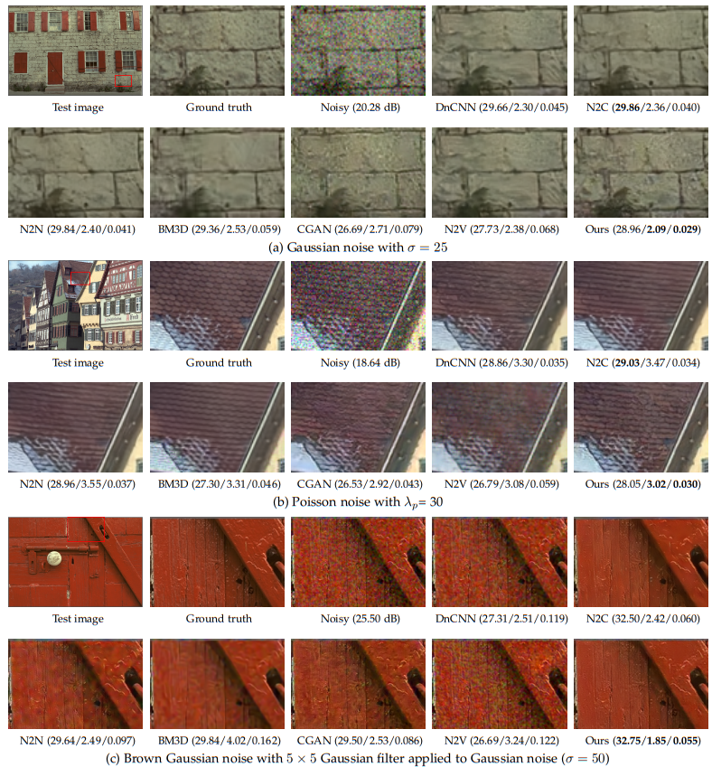
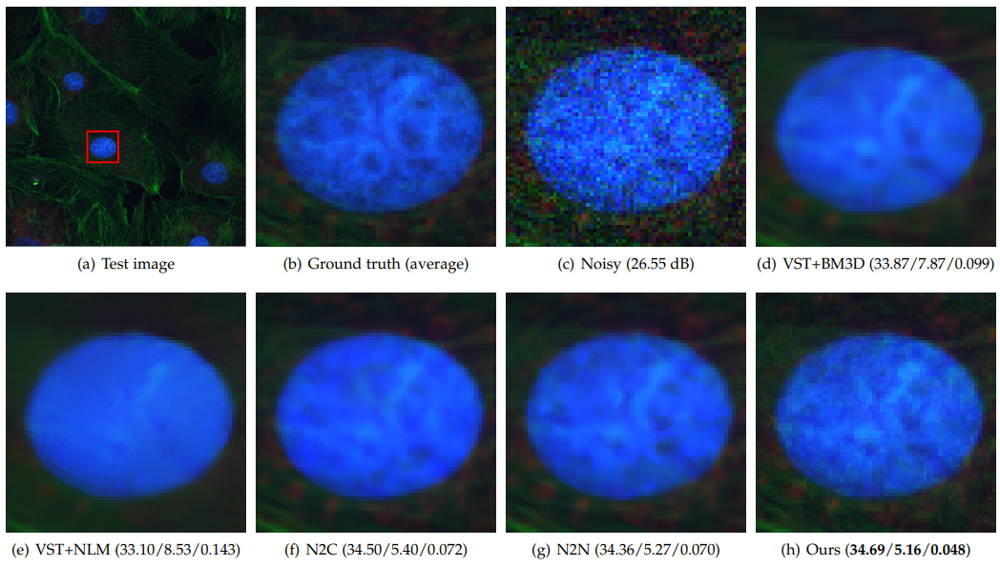
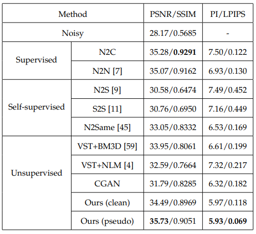

# Unsupervised Image Restoration Based on Optimal Transport

This code is used to reproduce the results of the optimal transport based restoration algortihm in the paper: 

Wei Wang, Zeyu Yan, Fei Wen, Rendong Ying, and Peilin Liu, "Optimal Transport for Unsupervised Restoration
Learning". 

Trained models are also provided in the `./checkpoint` folder. The proposed formulation is implemented in an adversarial training framework using [WGAN-gp](https://proceedings.neurips.cc/paper/2017/hash/892c3b1c6dccd52936e27cbd0ff683d6-Abstract.html). The generator is modified from part of [MPRNet](https://github.com/swz30/MPRNet) and the discriminator is modified from that of  [SRGAN](https://github.com/tensorlayer/srgan). We use them here only for academic use purpose.

## Datasets

In this section, we will introduce the datasets we use for each experiment. 

### Synthetic Noisy RGB Images

For three kinds of noises: Gaussian noise, Poisson noise and brown Gaussian, we use a RGB image dataset [BSDS500](https://www2.eecs.berkeley.edu/Research/Projects/CS/vision/grouping/resources.html) for training and the dataset [KODAK](http://r0k.us/graphics/kodak/) for testing.

### Synthetic Noisy Depth Images

We use a synthetic depth image dataset [SUNCG](https://sscnet.cs.princeton.edu/) for training and the depth image dataset [Middlebury](https://vision.middlebury.edu/stereo/data/) for testing.

### Real-world Microscope Images

We use a real fluorescence microscopy image dataset [FMD](https://drive.google.com/drive/folders/1aygMzSDdoq63IqSk-ly8cMq0_owup8UM) for training and testing.

### Real-World Photographic Images

We use a real smartphone photographic image dataset [SIDD](http://www.cs.yorku.ca/~kamel/sidd/) for training and testing.

### Real-World Depth Images

For training our model, we use a real depth image dataset collected by a kinect camera [NYU](https://cs.nyu.edu/~silberman/datasets/nyu_depth_v2.html#raw_parts)
as the noisy sample domain, and randomly collect the same
amount of patches from the SUNCG dataset as the
clean target domain. The NYU dataset contains 1,449 depth
images of indoor scenes and the corresponding RGB images
captured by a Kinect camera.

### Real-World Raw Depth Images

As the Kinect camera only provides pre-processed images, we additionally consider a raw depth denoising experiment using another commercial ToF camera which provides raw depth data without any pre-processing. We collect 1,430 raw depth images using this camera as the noisy sample
domain, which can be find at . For the clean target domain, we also randomly collect the same amount of patches from the SUNCG dataset.

All these datasets are only used for academic purpose.

## Getting started

### Python requirements

This code requires:

- Python 3.6
- torch 1.8.0
- h5py, opencv-python, numpy

### Preparing training dataset

We use the hdf5 files to store training data, you can use the code `generate_train_compress.m` for RGB images and `generate_train_compress_depth.m` for depth images in the folder `/gdata` to generate your own dataset from image folders. And the code `readH5.py` is used to merge two hdf5 files into one, which is useful in some experiments.

### Training networks

Take the synthetic Gaussian noise denoising on RGB images as an example, to train the proposed method:

```
cd denoise_gaussian_rgb
python train.py --nEpochs=200 --noise_sigma=50 --gpus="0" --trainset="../../BSDS500" --sigma=30
```

To train with the N2C method:

```
cd denoise_gaussian_rgb
python train_n2c.py --nEpochs=200 --noise_sigma=50 --gpus="0" --trainset="../../BSDS500"
```

To train with the N2N method:

```
cd denoise_gaussian_rgb
python train_n2n.py --nEpochs=200 --noise_sigma=50 --gpus="0" --trainset="../../BSDS500"
```

### Validation using a trained network

Take the synthetic Gaussian noise denoising on RGB images as an example, to run a validation dataset through a trained network:

```
cd denoise_gaussian_rgb
python test.py --model="./checkpoint/model_denoise_unet_n2c50200.pth" --dataset="./KODAK" --save="./results" --noise_sigma=25 --gpu="0"
```

## Some results

### (1) Results on synthetic noisy images:

**Visual comparison on synthetic noisy images with brown Gaussian noise. The images are enlarged for clarity.**



**Quantitative comparison on synthetic noisy RGB images with Gaussian, Poisson and Brown Gaussian noise.**


### (2) Results on real-world microscope images:

**Visual comparison on real-world microscopy images, where the ground-truth is obtained by averaging over 50 realizations of each scene. The images are enlarged for clarity.**



**Quantitative comparison on real-world microscope images.:**



### (3) Results on real-world raw depth images:

**Visual comparison on a real-world raw depth image captured by a commercial ToF camera. The RGB image is only used as a reference of the scene, which is not aligned with the depth image. “OT denoising” denotes our model trained on synthetic depth images with Gaussian noise.**


